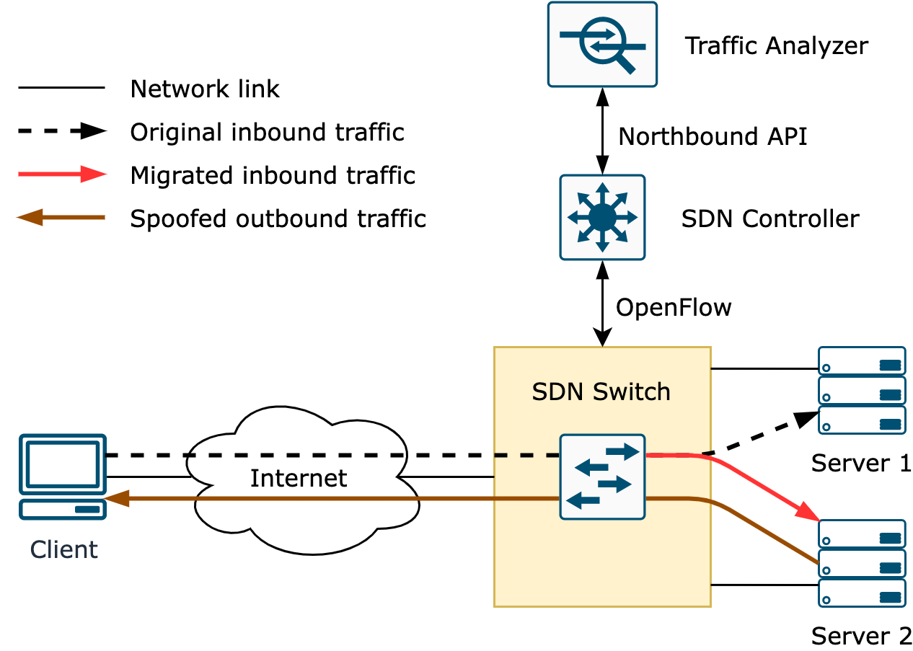
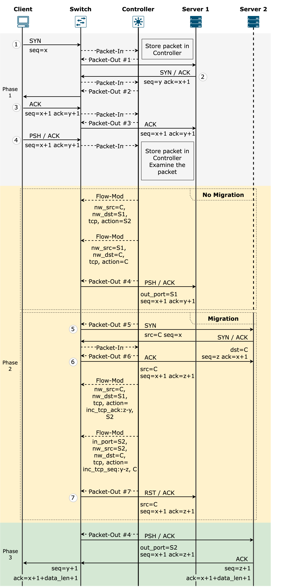
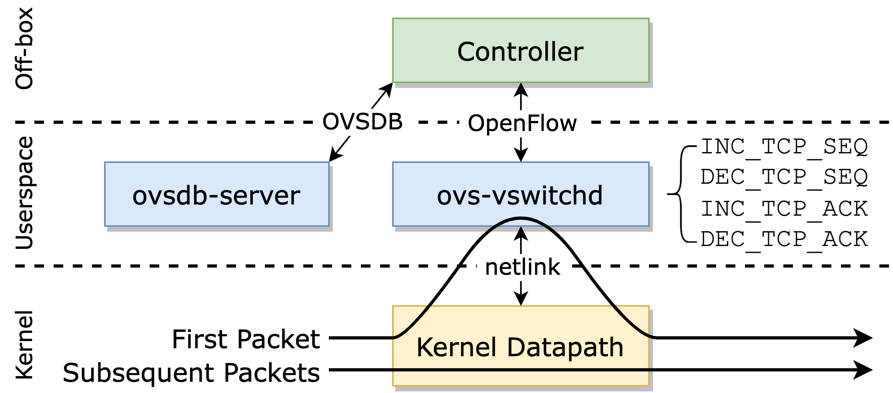

# SDN-based TCP Connection Migration
An SDN-based approach to enable migration of established TCP connections between endpoints by TCP traffic manipulation on the data plane. [slides](https://drive.google.com/file/d/1SwmxRUZeyxTgv6QceDaIJRIVodt_XZqO/view)


### System architecture


- [Traffic analyzer](#traffic-analyzer)
- [SDN controller](#sdn-controller)
- [SDN switch](#sdn-switch)


## Requirements
- Python 3.8 or above
- [Mininet](https://github.com/mininet/mininet) 2.3.0
- [modified Open vSwitch (OVS)](https://github.com/5062/ovs)
- [modified Ryu](https://github.com/5062/ryu)
- [Snort](https://www.snort.org/) 2.9

This demo has been tested on Ubuntu 20.04 LTS. 

## Getting Started

To set up the testbed, follow these steps:

### Start a root session
Much more convenient and reliable. 
```
$ sudo -i
```

### Install Mininet
1. Clone the [repository](https://github.com/mininet/mininet)
    ```
    # git clone -b 2.3.0 https://github.com/mininet/mininet
    ```

2. Install Mininet
    > **Note**: Install with the `-n` (dependencies and core files) option. Do not add `-v` (Open vSwitch) as we will install the modified OVS later. 
    ```
    # PYTHON=python3 ./mininet/util/install.sh -n
    ```

### Compile and install modified OVS
> **Note**: Remove existing OVS installation before installing the modified OVS. 
1. Clone the [repository](https://github.com/5062/ovs)
    ```
    # git clone https://github.com/5062/ovs
    # cd ovs
    ```
2. [Install dependencies](https://docs.openvswitch.org/en/latest/intro/install/general/#build-requirements)
    ```
    # apt-get install build-essential libssl-dev libcap-ng-dev autoconf automake libtool
    ```

3. [Build OVS](https://docs.openvswitch.org/en/latest/intro/install/general/#bootstrapping)
    ```
    # ./boot.sh
    # ./configure
    # make
    # make install
    ```

4. [Start OVS](https://docs.openvswitch.org/en/latest/intro/install/general/#starting)
    ```
    # export PATH=$PATH:/usr/local/share/openvswitch/scripts
    # ovs-ctl start
    ```

    To add the OVS scripts path to `$PATH` permanently (bash shell), run: 
    ```
    # echo 'export PATH=$PATH:/usr/local/share/openvswitch/scripts' >> ~/.bashrc
    ```

### Install modified Ryu framework
1. Clone the [repository](https://github.com/5062/ryu)
    ```
    # git clone https://github.com/5062/ryu
    ```
2. Install using `pip`
    ```
    # pip install ./ryu
    ```

### Install Snort
Install Snort using `apt-get`:
```
# apt-get install snort
```

### Install Python dependencies
1. Clone the repository
    ```
    # git clone https://github.com/5062/tcp-migration
    # cd tcp-migration
    ```
2. Install using `pip`
    ```
    # pip install -r requirements.txt
    ```

## Prototype Implementation
### Network Topology


- **Server 1** a TCP server listening on `10.0.0.1` and TCP port `11111`
- **Server 2** a TCP server listening on `10.0.0.2` and TCP port `11111`
- **Client** a TCP client sending messages to Server 1's address


Ryu receives Snort alerts from a unix domain socket (over UDP) at `/tmp/snort_alert`


## Usage
1. Start the network
    ```
    $ sudo python3 topo.py
    ```

2. Start the TCP migration controller in `c0`
    ```
    # ryu-manager tcp_migration.py
    ```
    The xterm windows 

3. Start `Server 1` in `h1`'s Xterm session
    ```
    # python3 server1.py
    ```

4. Start `Server 2` in `h2`'s Xterm session
    ```
    # python3 server2.py
    ```

5. Start `Client` in `h3`'s Xterm session
    ```
    # python3 client.py
    ```

Packet sniffers such as `tcpdump` or Wireshark. 

## Troubleshooting

### Test connectivity
```
mininet> dump
```

```
mininet> pingall
```

### Inspect flow table
If you're experiencing issues with the flow of traffic, you can inspect the flow table on the OVS switch to see if the SDN controller is correctly manipulating the TCP segments. 
```
$ sudo ovs-ofctl dump-flows s1
```

### Mininet cleanup
A "cleanup" command to get rid of junk (interfaces, processes, files in /tmp, etc.) which might be left around by Mininet or Linux. 
```
$ sudo mn -c
```


## System Design


### Components
- **Client** initiates a TCP connection to the server and sends a request within a TCP PSH-ACK segment.
- **Server 1** receives and processes requests from the client, and may hand off the TCP connection to Server 2 for migration.
- **Server 2** receives and handles migrated TCP connections from Server 1.
- **SDN Controller** manages the flow of traffic between the client and servers, and makes decisions about whether to migrate TCP connections based on messages received from the traffic analyzer.
- **Traffic Analyzer** analyzes the payload data of TCP segments and generates messages for the SDN controller with segment characteristics.
- **SDN Switch** forwards TCP segments between the client and servers as instructed by the controller, and installs flow entries for forwarding and synchronization of TCP state between the original and migrated connections.

### Phase 1: Client connection
Client initiates a TCP connection to Server 1 by sending a SYN segment. The SDN Controller recognizes this new connection, stores the SYN segment in memory, and instructs the Switch to forward subsequent TCP segments of the three-way handshake through Packet-Out messages. Once the TCP connection is established, the Client sends its request within a TCP PSH-ACK segment. The Traffic Analyzer then analyzes the payload data of the segment using a predefined set of detection rules and generates a message for the SDN Controller with characteristics of the segment. 

### Phase 2: Synchronizing TCP state
The SDN Controller makes a decision based on the message received from the Traffic Analyzer to perform connection migration. If the detection rules indicate that the connection does not require migration, it will be forwarded to Server 1. If migration is required, the connection will be handed over to Server 2. 

### Phase 3: Connection Handoff
The SDN Controller sends the original PSH-ACK packet from the Client to the Switch. The connection migration is completed after the Switch has installed flow entries for forwarding between the Client and Server 2, and for synchronizing TCP state between the original and migrated connections. These flow entries are applied to allow communication to continue between the Client and Server 2. 


### Traffic Analyzer
Snort is used as the network traffic analyzer. Snort is a rule-based system that uses rules to execute protocol analysis, content searching, and matching. These rules are written in Snort Rule Language and consist of three sections: header, options, and metadata. The header contains information on the rule action, protocol, source and destination IP addresses, and source and destination ports. The options provide the rule conditions, such as the payload content, while the metadata includes the rule description and other relevant information. 

The following Snort rules are used to detect TCP `PSH/ACK` packets sent to Server 1's address `10.0.0.1` that contains the content "forward" or "migrate" in their payload. 
- Alert with message "FORWARD"
    ```
    alert tcp any -> 10.0.0.1 any(msg:"FORWARD"; flags:PA; content:"forward"; classtype:connection-migration; sid:1000001;)
    ```
- Alert with message "MIGRATE"
    ```
    alert tcp any -> 10.0.0.1 any(msg:"MIGRATE"; flags:PA; content:"migrate"; classtype:connection-migration; sid:1000002;)
    ```

### SDN Controller
The SDN controller is built using Ryu, is an open-source component-based framework for creating SDN controllers. Ryu provides an integration library for Snort, which enables Snort to communicate with the SDN controller. This integration library uses the Ryu event system to listen for events generated by Snort and sends them to the controller application. The controller processes these events using an event handler function that is triggered when an event is received. 

### SDN Switch
The SDN switch is a modified version of OVS, which is composed of three components: 
- **vswitchd** the main userspace program for OVS. 
- **Open vSwitch database (ovsdb)** a lightweight database that stores the configuration and state (e.g. bridges, ports) of an OVS instance. 
- **Kernel module (datapath)** the main packet forwarding module of OVS, implemented in kernel space. 




#### Custom OVS actions
We added custom OVS actions in the [modified OVS](https://github.com/5062/ovs)

|OVS Action|Ryu Action|ovs-ofctl|Argument type|Description|
|---|---|---|---|---|
|`INC_TCP_SEQ`|`NXActionIncTcpSeq`|`inc_tcp_seq`|`uint32_t`|Increase `seq` in the TCP header by a value|
|`DEC_TCP_SEQ`|`NXActionDecTcpSeq`|`dec_tcp_seq`|`uint32_t`|Decrease `seq` in the TCP header by a value|
|`INC_TCP_ACK`|`NXActionIncTcpAck`|`inc_tcp_ack`|`uint32_t`|Increase `ack` in the TCP header by a value|
|`DEC_TCP_ACK`|`NXActionDecTcpAck`|`dec_tcp_ack`|`uint32_t`|decrease `ack` in the TCP header by a value|


## Acknowledgements
- Adding a new OVS action. [video](https://www.youtube.com/watch?v=6uKnpha15xY) [slides](https://www.dpdk.org/wp-content/uploads/sites/35/2020/12/OpenvSwitch_Action.pdf)
